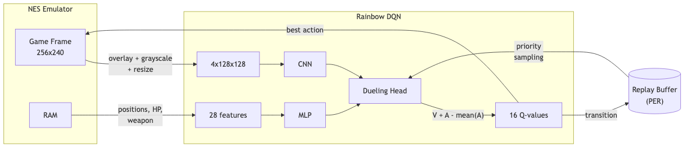

# Contra RL — Rainbow DQN

An AI agent learning to play **[Contra](https://en.wikipedia.org/wiki/Contra_(video_game))** (NES, 1988) using [Rainbow DQN](https://arxiv.org/abs/1710.02298) — combining 5 extensions of Deep Q-Network. The agent sees the game screen + game state features extracted from NES RAM, decides which buttons to press, and improves through thousands of attempts.

**Built from scratch with [Claude Code](https://claude.ai/code), just for fun. This is not a solved game — Contra is extremely demanding and achieving human-level play remains an open challenge for reinforcement learning.**


## How It Works



### The Agent
- **Sees**: 128x128 grayscale game frame with sprite overlays + 28 features extracted from RAM (4 [stacked frames](https://danieltakeshi.github.io/2016/11/25/frame-skipping-and-preprocessing-for-deep-q-networks-on-atari-2600-games/) for motion detection)
- **Decides**: Which of 16 button combinations to press (right, jump, shoot, combinations)
- **Learns from**: Scroll progress, enemy kills, turret/boss damage, weapon upgrades, death penalties

### Algorithm — Rainbow DQN (5/6)

| Extension | Description | Flag |
|-----------|------------|------|
| **Double DQN** | Online network selects action, target evaluates — reduces overestimation | always on |
| **Prioritised Replay (PER)** | Sample surprising transitions more often | `PRIORITISED_REPLAY` |
| **Dueling DQN** | Separate V(state) + A(action) streams — learn state value independently | `DUELING_DQN` |
| **Noisy Nets** | Learnable noise in weights — exploration without epsilon-greedy | `NOISY_NETS` |
| **N-step Returns** | Multi-step reward bootstrapping — faster credit assignment | `N_STEP_RETURNS` |

Plus: Huber loss (robust to outliers), gradient clipping, hybrid observation (pixels + game state features).

### Sprite Overlay
Enemy positions and bullets read from NES RAM and drawn as shape markers (14 enemy types from [ROM disassembly](https://github.com/vermiceli/nes-contra-us)):

- **Rectangles** — soldiers (running man, sniper, scuba diver, turret man)
- **Triangles** — turrets (rotating gun, red turret, wall cannon, boss turret)
- **Circles** — projectiles (enemy bullets, mortar shots)
- **Diamonds** — pickups (weapon box, flying capsule) and boss door

### Reward System
| Signal | Value | Purpose |
|--------|-------|---------|
| Map progress | `scroll_delta * 1.6 * speed_bonus` | Moving forward through the level |
| Enemy kill | `score_delta * 15` | Incentivize shooting |
| Turret/boss hit | `+50 per hit` | Reward damaging multi-HP enemies |
| Weapon upgrade | `+100 per strength level` | Pick up better weapons (Spread = +300) |
| Death | `-500` | Avoid enemies and bullets |

### Per-Level Models
Each level has its own model, replay buffer, and statistics. Switch levels with `Cmd/Ctrl+1-8`. Level names from ROM:

| Key | Level |
|-----|-------|
| 1 | Jungle |
| 2 | Base 1 |
| 3 | Waterfall |
| 4 | Base 2 |
| 5 | Snow Field |
| 6 | Energy Zone |
| 7 | Hangar |
| 8 | Alien's Lair |

### Stability
- **Auto-rollback**: If average reward drops 50% from peak, loads the best checkpoint (per level)
- **Auto-save**: Best model saved on new peak (per level)
- **Practice mode**: Save/load game state for targeted training on specific sections

## Tech Stack

| Component | Technology |
|-----------|-----------|
| NES Emulator | [cynes](https://github.com/Youlixx/cynes) (Rust, ARM64 + x86_64) |
| RL Algorithm | Rainbow DQN ([PyTorch](https://pytorch.org)) |
| GPU | Apple Silicon [MPS](https://developer.apple.com/metal/) / NVIDIA [CUDA](https://developer.nvidia.com/cuda-toolkit) / CPU |
| Dashboard | [FastAPI](https://fastapi.tiangolo.com) + WebSocket + [Chart.js](https://www.chartjs.org) + [Tippy.js](https://atomiks.github.io/tippyjs/) |
| ROM Analysis | [Contra NES Disassembly](https://github.com/vermiceli/nes-contra-us) |

## Dashboard

Real-time web dashboard at **http://localhost:41918**:

- **Live game preview** — click to swap main/agent view
- **Overview** — episodes, timesteps, FPS, buffer, RAM usage
- **Live tab** — rewards breakdown, events feed, agent view (enemies/bullets/weapon), features, actions
- **Leaderboard** — top runs per level
- **Levels** — switch levels, per-level stats
- **Config** — all hyperparameters with tooltips
- **Reward History** — chart with toggleable datasets (reward, boss reach %), crosshair on hover
- **Level Progress** — death heatmap, practice marker, PB line
- **Keyboard**: Space (pause), Arrow Right (step), Cmd/Ctrl+1-8 (switch level)

## Watch Mode (FCEUX)

Watch the agent play with real NES audio:

```bash
brew install fceux
./scripts/watch.sh
```

FCEUX sends screen pixels + RAM to Python. The agent applies overlay and runs inference. NES 2C02 palette matched between emulators.

**Note**: The agent plays worse in FCEUX than in training because:
- **Input latency** — file-based communication adds ~2 frame delay. In Contra, 2 frames decide between dodging a bullet and dying.
- **Decision instability** — early models assign nearly identical scores to different actions, so small pixel differences between emulators can flip the chosen action entirely.

The web dashboard shows the true agent performance.

## Quick Start

```bash
python3.11 -m venv .venv
source .venv/bin/activate
pip install -e .

cp /path/to/contra.nes roms/contra.nes
cp .env.example .env  # edit DEVICE=mps for Apple Silicon

./start-fresh.sh      # fresh training
./start.sh            # resume from checkpoint
```

## Project Structure

```
contra-rl-dqn/
├── contra/
│   ├── env/
│   │   ├── contra_env.py     # NES environment, reward, sprite overlay, level switching
│   │   └── wrappers.py       # Grayscale, resize, frame stack, stream capture
│   ├── training/
│   │   ├── dqn.py            # Rainbow DQN: Dueling, Noisy, N-step, PER, Double
│   │   └── callbacks.py      # Frame buffer, per-level best run recording
│   ├── web/
│   │   ├── server.py         # FastAPI dashboard, WebSocket, level/model APIs
│   │   └── static/           # HTML, CSS, JS (Tippy.js tooltips, Chart.js)
│   └── stats/
│       └── tracker.py        # Per-level stats, persistence, death heatmap
├── config/settings.py        # All settings with feature flags
├── scripts/
│   ├── run.py                # Main entry point
│   ├── watch.py              # FCEUX watch mode
│   ├── watch.sh              # One-command launcher
│   ├── fceux_agent.lua       # FCEUX Lua bridge
│   └── ram_monitor.py        # RAM debugging (play in FCEUX, monitor changes)
├── docs/                     # Plans, narration script
├── roms/                     # ROM + NES palette (gitignored)
└── checkpoints/              # Model checkpoints per level (gitignored)
```

## RAM Addresses

Verified against [ROM disassembly](https://github.com/vermiceli/nes-contra-us) and [Data Crystal](https://datacrystal.tcrf.net/wiki/Contra_(NES)/RAM_map):

| Address | Name | Notes |
|---------|------|-------|
| `$64` | `LEVEL_SCREEN_NUMBER` | Camera screen index |
| `$65` | `LEVEL_SCREEN_SCROLL_OFFSET` | Pixels within screen |
| `$90` | Player state | 0=respawn, 1=alive, 2=dead |
| `$30` | `CURRENT_LEVEL` | 0-7 (Jungle to Alien's Lair) |
| `$32` | `P1_NUM_LIVES` | 0 = last life |
| `$84` | `BOSS_AUTO_SCROLL_COMPLETE` | 1 = boss revealed |
| `$AA` | `P1_CURRENT_WEAPON` | 0=R, 1=M, 2=F, 3=S, 4=L, 5=B |
| `$AE` | Invincibility timer | 127→0 after respawn |
| `$334` | Player X | Screen position |
| `$31A` | Player Y | Screen position |
| `$528` | `ENEMY_TYPE` | 16 slots ([full list](https://github.com/vermiceli/nes-contra-us/blob/main/src/bank7.asm#L9161)) |
| `$578` | `ENEMY_HP` | Boss door=32, turrets=8 |
| `$4B8` | `ENEMY_ROUTINE` | 0=dead |
| `$33E` | `ENEMY_X_POS` | 16 slots |
| `$324` | `ENEMY_Y_POS` | 16 slots |
| `$508` | `ENEMY_X_VELOCITY_FAST` | Movement direction |
| `$5A8` | `ENEMY_ATTRIBUTES` | Weapon code for items |

cynes uses reversed bit order: `NES_INPUT_RIGHT=1`, `NES_INPUT_A=128`.

## License

Educational and research purposes. Contra is a trademark of Konami. You must provide your own legally obtained ROM.
