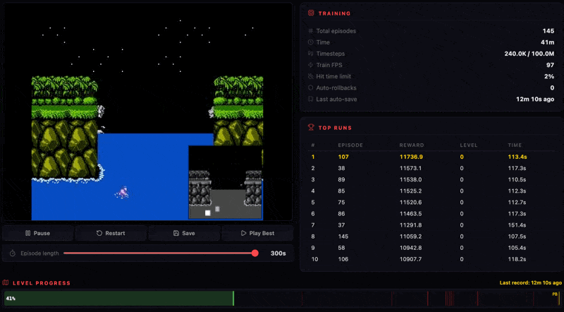
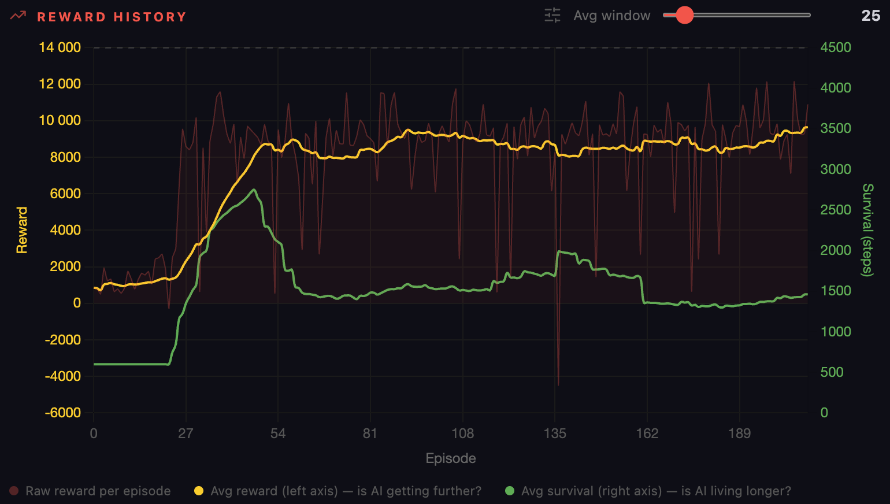

# Contra RL Deep Q-Network

A [reinforcement learning](https://en.wikipedia.org/wiki/Reinforcement_learning) agent that learns to play **[Contra](https://en.wikipedia.org/wiki/Contra_(video_game))** (NES, 1988) from raw pixels, using [Deep Q-Network](https://en.wikipedia.org/wiki/Q-learning#Deep_Q-learning) with [experience replay](https://en.wikipedia.org/wiki/Experience_replay). The agent watches the game screen, decides which buttons to press, and improves through thousands of attempts.

Built from scratch with [Claude Code](https://claude.ai/code) (Opus 4.6), just for fun.



## How It Works

### The Agent
- **Sees**: 128x128 grayscale game frame with sprite overlays + 28 RAM features (4 [stacked frames](https://danieltakeshi.github.io/2016/11/25/frame-skipping-and-preprocessing-for-deep-q-networks-on-atari-2600-games/) for motion detection)
- **Decides**: Which of 16 button combinations to press (right, jump, shoot, combinations)
- **Learns from**: Scroll progress, enemy kills, and death penalties
- **Algorithm**: DQN with Double DQN, Prioritised Experience Replay (PER), 100K replay buffer

### Sprite Overlay
Enemy positions and bullets are read directly from NES RAM and drawn onto the game frame as visual markers.

- **White rectangles** — moving enemies (soldiers, runners)
- **White dots** — enemy projectiles
- **Gray rectangle** — player character
- **Light gray dots** — player bullets
- Static enemies (turrets) are not marked — they're part of the level layout and the agent learns their positions through repetition.

### Reward System
| Signal | Value | Purpose |
|--------|-------|---------|
| Screen scroll | `scroll_delta * 0.08 * speed_bonus` | Progress through the level |
| Enemy kill | `score_delta * 15` | Incentivize shooting |
| Death | `-500` | Avoid enemies and bullets |
| Turret hit | `+50` | Reward each bullet that damages a turret |
| Standing still (>0.7s) | `-0.5 / step` | Don't idle |

### Training Progress



### Why DQN over PPO?
We started with [PPO](https://arxiv.org/abs/1707.06347) but it suffered from **[catastrophic forgetting](https://en.wikipedia.org/wiki/Catastrophic_interference)** — the agent would learn to play well, then suddenly "forget" everything and stand still. DQN's replay buffer stores 100K past experiences and learns from them repeatedly. A rare successful dodge is seen hundreds of times during training, not just once.

### Stability
- **Auto-rollback**: If average reward drops 50% from peak, loads the best checkpoint
- **Auto-save**: Stats saved every 50 episodes, best model saved on new peak
- **Manual Save**: Dashboard button to checkpoint when agent plays well

## Tech Stack

| Component | Technology |
|-----------|-----------|
| NES Emulator | [cynes](https://github.com/Youlixx/cynes) (Rust, ARM64 + x86_64) |
| RL Algorithm | DQN + Double DQN + PER ([PyTorch](https://pytorch.org)) |
| GPU | Apple Silicon [MPS](https://developer.apple.com/metal/) / NVIDIA [CUDA](https://developer.nvidia.com/cuda-toolkit) / CPU |
| Dashboard | [FastAPI](https://fastapi.tiangolo.com) + WebSocket + [Chart.js](https://www.chartjs.org) + [Lucide](https://lucide.dev) icons |
| Video Replay | [FFmpeg](https://ffmpeg.org) (H.264) |

## Dashboard

Real-time web dashboard for monitoring training:

- **Live game preview** at ~45fps with agent view overlay in corner
- **Reward history chart** with configurable rolling average + survival time
- **Level progress bar** with death heatmap
- **Top runs table** with reward, level, and duration
- **Config tab** with all hyperparameters and feature flags
- **Controls** (admin only): Pause, Restart, Save Model, Best Replay, Save/Clear State (practice mode)

## Watch Mode (FCEUX with Audio)

Watch the agent play with real NES audio using [FCEUX](https://fceux.com):

```bash
brew install fceux
./scripts/watch.sh
# Select 1 Player in the FCEUX window — agent takes over
```

FCEUX sends screen pixels + RAM to Python via file bridge. Python runs the model and sends actions back. The agent receives the same overlay and features as during training.

**Note**: The agent plays slightly worse in FCEUX than in training due to:
- ~2 frame input latency (file I/O)
- Minor pixel differences between emulators (cynes vs FCEUX palette)
- Early models have very close Q-values, making them sensitive to small input changes

The web dashboard shows the true agent performance.

## Practice Mode

Save/Load NES game state for targeted training on specific sections:

- **Save State** — saves current game moment; agent respawns here after every death
- **Clear State** — removes saved state, back to normal training
- Stats are not recorded during practice (marked as PRACTICE in dashboard)
- Model is auto-saved before practice starts (`pre_practice.pt`) as safety net

Useful for training on boss fights or difficult sections without playing through the entire level each time.

## Quick Start

### Prerequisites
- Python 3.10+
- Legally obtained Contra NES ROM

### Setup
```bash
python3.11 -m venv .venv
source .venv/bin/activate
pip install -e .

# Place your ROM
cp /path/to/contra.nes roms/contra.nes
```

### Training
```bash
# Fresh start
./start-fresh.sh

# Resume from last checkpoint
./start.sh
```

Dashboard: **http://localhost:41918**

For GPU acceleration on Apple Silicon, set `DEVICE=mps`. For NVIDIA: `DEVICE=cuda`.

## Project Structure

```
contra-rl-dqn/
├── contra/
│   ├── env/
│   │   ├── contra_env.py     # NES environment, reward, death detection, sprite overlay
│   │   └── wrappers.py       # Grayscale, resize 128x128, frame stack, stream capture
│   ├── training/
│   │   ├── dqn.py            # DQN + Double DQN + PER, auto-rollback
│   │   └── callbacks.py      # Frame buffer, best run recording
│   ├── web/
│   │   ├── server.py         # FastAPI dashboard, dual WebSocket (frames + stats)
│   │   └── static/           # HTML, CSS, JS
│   └── stats/
│       └── tracker.py        # Episode stats, persistence, death heatmap
├── config/
│   └── settings.py           # Training hyperparameters
├── scripts/
│   ├── run.py                # Main entry point
│   ├── watch.py              # FCEUX watch mode (agent + audio)
│   ├── watch.sh              # One-command launcher
│   └── fceux_agent.lua       # FCEUX Lua bridge script
├── roms/                     # ROM + NES palette (gitignored)
├── checkpoints/              # Model checkpoints (gitignored)
└── start.sh / start-fresh.sh # Launch scripts
```

## RAM Addresses (Contra NES)

Discovered through systematic RAM scanning with cynes (full NES RAM map: [Data Crystal](https://datacrystal.tcrf.net/wiki/Contra_(NES)/RAM_map)):

| Address | Purpose | Notes |
|---------|---------|-------|
| `$90` | Player state | 0=respawn, 1=alive, 2=dead |
| `$60` | Scroll coarse | Camera position (tiles) |
| `$65` | Scroll fine | Camera sub-tile offset |
| `$30` | Current level | 0-7 = stage 1-8 |
| `$7E2` | Player 1 score | Kill counter |
| `$334` | Player X | Screen position |
| `$31A` | Player Y | Screen position |
| `$33E-$347` | Enemy X positions | 16 slots |
| `$324-$32D` | Enemy Y positions | 16 slots |
| `$528` | Enemy types | 16 slots |
| `$580` | Enemy/turret HP | 16 slots, counts DOWN per hit (turret: 7→0 = destroyed) |
| `$504` | Turret rotation | 8 directions (0/32/64/96/128/160/192/224) |
| `$508` | Enemy X velocity | For static vs moving detection |

**Important**: cynes uses reversed bit order for controller input (`NES_INPUT_RIGHT=1`, `NES_INPUT_A=128`).


## License

Educational and research purposes. Contra is a trademark of Konami. You must provide your own legally obtained ROM.
